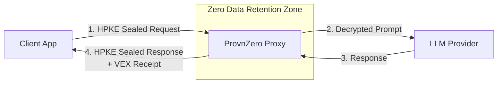

# ProvnZero
> **Zero knowledge. Zero retention. Zero compromise.**

**ProvnZero** is a high-performance Zero Data Retention (ZDR) proxy for AI APIs. If you are building enterprise AI applications, sending sensitive data (PII, trade secrets, medical records) in plaintext to cloud LLMs is a massive liability. ProvnZero fundamentally solves this: we seal the data on the client, unwrap it securely in memory only at the moment of API transmission, and cryptographically shred it instantly afterward.

## Why Rust?

ProvnZero's bold claims are backed by Rust's strict memory model. Unlike garbage-collected languages where plaintext strings might linger in memory indefinitely, Rust allows ProvnZero to allocate highly restricted `SecureBuffer` memory regions and cryptographically wipe them using OS-level constructs (`zeroize`) the exact instant they drop out of scope.

## Deployment Models: Where Does This Run?

ProvnZero is built in high-performance Rust and is designed to sit directly between your client applications and the LLM providers. Because it is a standalone binary (and containerizable), you can run it anywhere:

1. **Local Edge Gateway**: Run ProvnZero directly on the same physical server or local network as your AI agents. The agents talk to `localhost:3001` over the local loopback, and ProvnZero handles the secure outbound tunnel to OpenAI.
2. **Cloud Service Proxy (e.g., Railway, Heroku)**: Deploy ProvnZero to a generic cloud provider. Your remote clients (mobile apps, web apps) seal their data via the SDK and send it to your hosted ProvnZero URL. It is pre-configured for instant **Railway** deployments out-of-the-box.
3. **Enterprise VPC**: Run it inside your corporate Virtual Private Cloud. All internal company apps route internal LLM requests through the proxy to ensure no prompts leak into standard company HTTP logs.
4. **Confidential Computing (Future)**: The Rust binary is perfectly sized to run inside AWS Nitro Enclaves or Intel SGX, providing a hardware-rooted guarantee of the ZDR claims.

## Core Features

- **Standard Cryptography**: Uses **RFC 9180 HPKE** (Hybrid Public Key Encryption) for client-side payload sealing. The proxy only sees opaque byte arrays over the wire.
- **Zero Data Retention**: Powered by Rust's memory safety guarantees. Exclusively uses `SecureBuffer` and the `zeroize` crate to cryptographically wipe ephemeral decryption keys and plaintext from RAM immediately after the LLM responds.
- **Cryptographic Audit Trails**: Generating text logs defeats the purpose of ZDR. Instead, ProvnZero generates Ed25519-signed **VEX (Vulnerability Exploitability eXchange)** receipts, producing mathematical proof that an inference request was safely handled without emitting the prompt itself.
- **Universal Compatibility**: Out-of-the-box support for OpenAI, Anthropic, and DeepSeek. Furthermore, it supports *any* OpenAI-compatible endpoint on earth (e.g., Groq, OpenRouter, vLLM, Ollama) via the `OPENAI_BASE_URL` override.
- **Production Ready**: Built on Axum's async runtime and hardened with `tower-governor` rate-limiting to prevent API abuse, alongside `tokio` graceful shutdown handlers to prevent memory leaks during container orchestration.

## Project Structure

This repository is a monorepo containing:

- [**provnzero-proxy**](./provnzero-proxy/): The core Rust (Axum) proxy service. This is the server you deploy.
- [**provnzero-sdk**](./provnzero-sdk/): The TypeScript wrapper for client integration. This handles the complex client-side HPKE math before your app makes the network request.

## Architecture Flow

## Real-World Validation

In live testing against the **Groq API** (`llama3-8b-8192`), ProvnZero passed 100% of automated integration tests (12/12). 

This validates three core proxy capabilities:
1. **Cryptography**: HPKE sealed payloads unwrap seamlessly.
2. **Concurrency**: Parallel, rapid-fire requests resolve perfectly under `tower-governor` rate limits.
3. **ZDR Enforcement**: Memory is destroyed (`zeroized`) after every round-trip, yielding mathematically valid Ed25519 VEX receipts.

## Quick Start

### 🚂 1-Click Cloud Deployment (Railway)

ProvnZero is natively containerized and configured for Railway. Clicking the button above will automatically provision a production-ready, zero-retention proxy instance with strict Axum rate limits pre-configured.

**Required variables during setup:**
* `OPENAI_API_KEY`: Required to authenticate outbound traffic.
* *Optional*: Set `OPENAI_BASE_URL` if you wish to proxy to a different provider (e.g., Anthropic, Deepseek, locally hosted vLLM).

Once deployed, point your client application (using the `provnzero-sdk`) to your new Railway `.up.railway.app` URL!

### Manual Integration
1. **Deploy the Proxy manually**: Follow the [Proxy README](./provnzero-proxy/README.md) to start the Rust server locally.
2. **Integrate the SDK**: Follow the [SDK README](./provnzero-sdk/README.md) to initialize the client in your Node/TypeScript application.

## Community & Security

If ProvnZero solves a critical infrastructure problem for you, **please give this repo a ⭐️ on GitHub**! Your support drives engagement and signals trust to enterprise adopters.

- Want to hack on ProvnZero? See our [Contributing Guide](CONTRIBUTING.md).
- Discovered a vulnerability? Please review our [Security Policy](SECURITY.md).

---
## License

This project is licensed under the Apache License 2.0 - see the [LICENSE](LICENSE) file for details.
